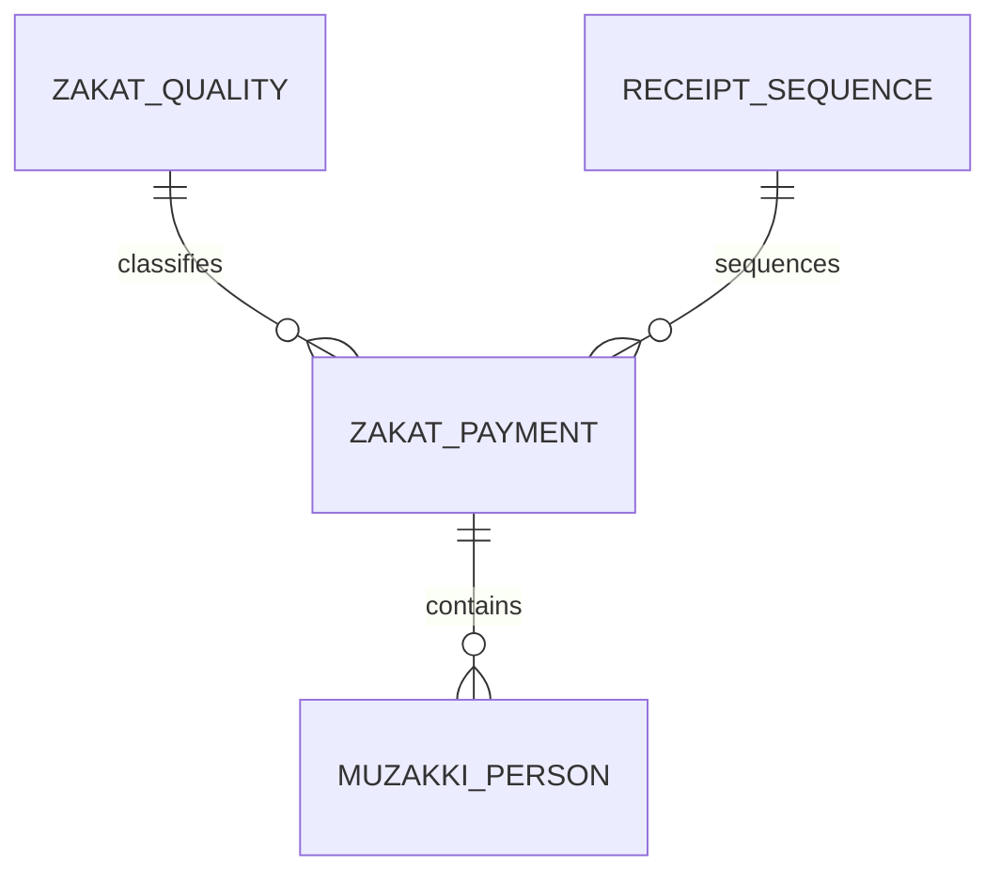

# Domain Model ZIS

Dokumen ini menjadi baseline domain model untuk rewrite `zis-app` dari sistem Java ke PHP native. Model di bawah sudah diselaraskan dengan entitas dan migration yang ada pada repo Java lama di `/Users/singgihperdana/data/source_code/projects/zis-app`.

## Entitas Inti

- `users`
  Dipakai untuk login admin/operator/viewer. Di sistem Java field utamanya adalah `username`, `email`, `password`, `role`, dan `active`.

- `institution_profile`
  Profil lembaga/masjid untuk nama instansi, alamat, kontak, ketua, dan bendahara.

- `zakat_quality`
  Master kualitas/opsi zakat, misalnya beras 2.5 kg, beras 3.0 kg, standar uang, premium uang.
  Entitas ini membawa `zakat_type`, `berat_per_jiwa_kg`, dan `nominal_per_jiwa`.

- `receipt_sequence`
  Menyimpan sequence nomor kwitansi per tahun.

- `zakat_payment`
  Header transaksi pembayaran ZIS. Ini entitas operasional paling penting di sistem Java lama.
  Mencakup data payer, nominal per kategori, metode bayar, nomor kwitansi, pembatalan, audit, dan relasi ke `zakat_quality`.

- `muzakki_person`
  Daftar orang/muzakki yang terkait ke satu `zakat_payment`, dengan urutan `sequence_no`.

## Relasi

## Catatan Mapping dari Sistem Lama

Entity yang sudah teridentifikasi dari repo Java:

- `User`
- `InstitutionProfile`
- `ZakatQuality`
- `ReceiptSequence`
- `ZakatPayment`
- `MuzakkiPerson`

Enum yang relevan:

- `UserRole`
- `PaymentMethod`
- `ZisType`

## Langkah Lanjut yang Disarankan

- tambah tabel atau view laporan rekap agar cocok dengan `ReportService` Java
- tambah generator nomor kwitansi berbasis `receipt_sequence`
- tambah fitur render PDF kwitansi berbasis `zakat_payment`
- tambah `audit_logs` bila perubahan data perlu dilacak
